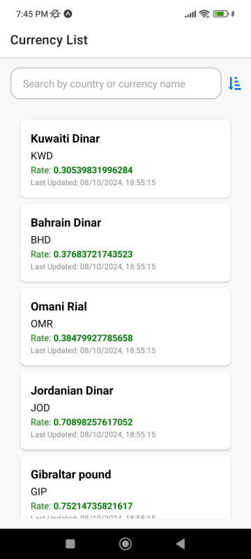
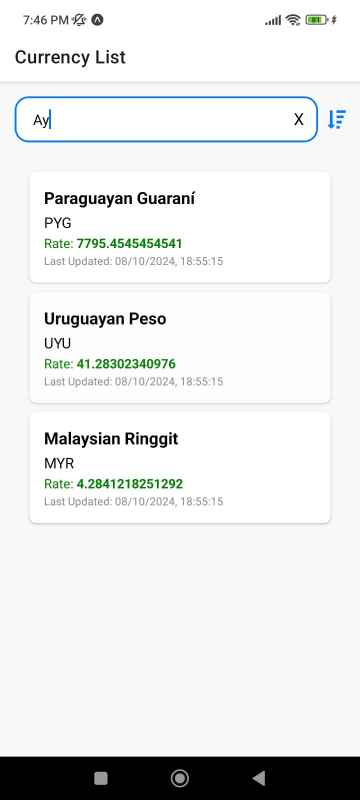

# Currency Conversion App

## Description
The Currency Conversion App is a cross-platform mobile application built with React Native and Expo that allows users to view and search for currency conversion rates. The app fetches real-time currency rates and provides functionality to search by country or currency name. Additionally, it allows users to convert any amount from the selected currency to USD or vice versa. The app also includes sorting options to display currency rates in ascending or descending order.



## Features
- Search for currencies by country or currency name using the `contains` method for efficient matching.

- Convert any amount from the selected currency to USD or vice versa.

- Sort currencies by conversion rate in ascending or descending order.
- Fetches real-time data from the Floatrates API.

## Technologies Used
- **React Native**: For building the mobile application.
- **Expo**: A framework for React Native to simplify development and deployment.
- **Zustand**: A state management library for managing currency data.
- **Axios**: A promise-based HTTP client for making API requests.
- **React Navigation**: For navigating between screens in the app.
- **FontAwesome**: For using icons in the app.

## Dependencies
To install the required dependencies, run the following command:

```bash
npm install
```

After installation, start the project using:
```bash
npx expo start
```

## Code Structure
The project is organized as follows:

### 1. `App.js`
The entry point of the application. This file sets up navigation and renders the main screens.

### 2. `screens/CurrencyListScreen.js`
This screen displays the list of currencies fetched from the API. The user can search for a currency, clear the search field, and sort the list by conversion rate. It handles fetching the currency data using the `useFetchCurrencyRates` hook and manages the search query and sort order state.

**Key functionalities include:**
- **Search Field**: Allows users to search for a currency by its country or currency name.
- **Sort Button**: Toggles between ascending and descending order of conversion rates.
- **Clear Button**: Resets the search query and clears the search field.

### 3. `components/CurrencyItem.js`
This component renders each currency in the list. It displays the country, currency name, conversion rate, and last updated time. The user can click on a currency to navigate to a detailed conversion page.

**Key properties:**
- `currency.country`: Name of the country.
- `currency.currencyName`: Name of the currency.
- `currency.rate`: Conversion rate to USD.
- `currency.lastUpdated`: Time of the last update.

### 4. `hooks/useFetchCurrencyRates.js`
Custom hook that handles fetching currency data from the Floatrates API. It is called when the `CurrencyListScreen` component mounts to ensure that currency data is always up-to-date.

### 5. `store/useCurrencyStore.js`
This is where the state management happens using the Zustand library. It stores the list of currencies and updates them after the API call.

### 6. `navigation/`
This folder contains the navigation setup for the app using React Navigation. It helps in switching between screens such as the currency list and the converter screen.

### 7. **Currency Conversion Functionality**
On selecting a currency, the user is taken to a screen where they can convert any amount between the selected currency and USD or vice versa. The logic behind the conversion is based on the conversion rate provided by the API.

## How It Works
1. When the app starts, it fetches the latest conversion rates for USD and various currencies from the Floatrates API.
2. The main screen displays a list of currencies with options to search and sort them.
3. Users can select a currency to navigate to the conversion screen, where they can enter an amount and convert it between the selected currency and USD.
4. State management is handled by Zustand, and the UI includes smooth animations provided by the Animatable library.


## Known Issues

### Deprecated Packages
During the development of this app, some deprecated packages were installed as part of the required dependencies. These were automatically pulled in when installing third-party libraries used for the project.

The deprecated packages include:
- `osenv`
- `inflight`
- Several `@babel` plugins

Although these packages are deprecated, they do not currently affect the core functionality of the application. However, for long-term maintenance and scalability, it would be advisable to update or replace these dependencies with actively supported alternatives.

If this were a production-level application, additional steps would be taken to replace these deprecated dependencies with up-to-date versions or alternatives to ensure stability and security.
